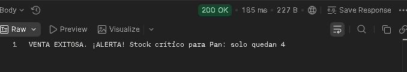

#Sistema de Gestión para Mini Market 
---

##  Tecnologías Utilizadas

- **Lenguaje:** Java 17
- **Framework:** Spring Boot 3
- **Persistencia:** Spring Data JPA
- **Base de Datos:** PostgreSQL
- **Pruebas:** Postman

---

##  Funcionalidades Principales

1.  **Gestión de Inventario:** CRUD completo de productos.
2.  **Motor de Ventas:** Actualización automática de stock en cada transacción.
3.  **Alertas de Negocio:** Notificación de **Stock Crítico** (menos de 5 unidades).
4.  **Trazabilidad:** Historial de ventas y sistema de anulación con restauración de inventario.
5.  **Buscador:** Filtros inteligentes por nombre e ignorando mayúsculas.

---

---

##  Documentación de la API (Endpoints)

Para interactuar con el sistema, se han habilitado los siguientes puntos de acceso. Puedes probarlos utilizando herramientas como **Postman**.

###  Productos
*   **Listar Inventario**  
    `GET /productos`  
    Retorna la lista completa de productos registrados con su stock y precio actual.

*   **Buscador Inteligente**  
    `GET /productos/buscar?nombre={valor}`  
    Filtra productos que coincidan con el nombre proporcionado (no distingue entre mayúsculas y minúsculas).

*   **Procesar Venta**  
    `POST /productos/{id}/vender`  
    Registra una transacción. Descuenta el stock automáticamente y genera una alerta si el inventario es crítico (< 5 unidades).

###  Ventas y Finanzas
*   **Historial de Transacciones**  
    `GET /ventas`  
    Muestra el detalle cronológico de todas las ventas realizadas en el sistema.

*   **Anulación de Venta**  
    `DELETE /ventas/{id}/anular`  
    Elimina el registro de la venta y restaura las unidades al stock del producto original para mantener la integridad de los datos.

*   **Reporte de Recaudación**  
    `GET /productos/reporte`  
    Calcula el total de ingresos generados por las ventas registradas.

---

##  Evidencia de Funcionamiento

A continuación, se muestran ejemplos de las respuestas del servidor tras realizar pruebas en el entorno de desarrollo:

### Confirmación de Venta y Alerta de Stock
En esta captura se observa cómo el sistema procesa la venta y emite una alerta cuando el stock resultante es bajo.

*Nota: Las capturas de pantalla han sido tomadas directamente desde Postman utilizando el entorno local.*
